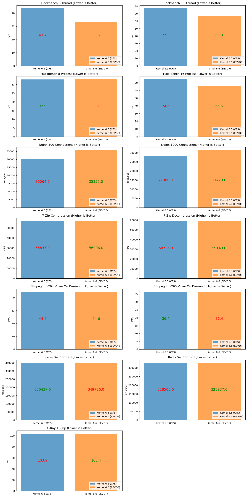

# CFS vs EEVDF

Some benchmarks w/ Phoronix Test Suite for trying to compare CFS and EEVDF CPU schedulers on Linux. Done just for reference not a fully comprehensive/scientific test (see [notes](#notes)).

## Background

Completely Fair Scheduler (CFS) and "Earliest Eligible Virtual Deadline First" (EEVDF) are both CPU scheduling algorithms used in Linux kernels. CFS was brought into Linux in kernel 2.6, but lacked a proper explicit way to deal with latency requirements. Eventually, it was replaced in kernel 6.6 by EEVDF which provided a better explicit way to handle and minimize latency.

For a better resource on what they are and how they work, see [here](https://lwn.net/Articles/925371/) on EEVDF and [here](https://developer.ibm.com/tutorials/l-completely-fair-scheduler/) on CFS.

## Testing Details

Ran benchmarks with laptop (bare metal), with CPU set to governor. Below list some info for testing.

### System Info

- CPU: Ryzen 7 4800H
- RAM: 16 GB DDR4 3200 MHz (2x8GB SODIMM)
- GPU: RTX 2060 (Laptop)
- OS: Arch Linux (see kernel versions below)

### Kernel

Arch Linux with compiled kernel 6.6 and 6.5.

- CFS: [6.5](https://git.kernel.org/pub/scm/linux/kernel/git/torvalds/linux.git/tag/?h=v6.5)
- EEVDF: [6.6](https://git.kernel.org/pub/scm/linux/kernel/git/torvalds/linux.git/tag/?h=v6.6)

### Benchmark Utils

Used hackbench as it seems to be popular amongst maintainers for testing kernel schedulers. Others were chosen to test real-world application that rely more on CPU.

- Phoronix Test Suite
  - [Hackbench](https://openbenchmarking.org/test/pts/hackbench) (8, 16 process and threads)
  - [7Zip](https://openbenchmarking.org/test/pts/compress-7zip) (Compress + Decompress)
  - [NGINX](https://openbenchmarking.org/test/pts/nginx) (500, 1000 connections)
  - [C-Ray](https://openbenchmarking.org/test/pts/c-ray) (1080p)
  - [FFMPEG](https://openbenchmarking.org/test/pts/ffmpeg) (Video-On-Demand)
  - [Redis](https://openbenchmarking.org/test/pts/redis) (1000 get, set)

## Results

## Other Related Benchmarks

Michael Larabel, lead developer of Phoronix Test Suite, also did some benchmarking comparing kernel 6.5.1 and 6.6-rc1 with a much higher core count processor. In some applications he found major improvements (eg. TiDB) which he believed to be from change in CPU scheduler. See [here](https://www.phoronix.com/review/linux-66-bergamo) for article with results.

Rene Rebe, a Linux maintainer, also found over 10% increase in building Firefox in his [video](https://www.youtube.com/watch?v=3UMBVHol3Ic) and mentions that it could be largely due to the EEVDF scheduler.

Also [here](https://www.youtube.com/watch?v=KgwbHRG7Q3s&t=65s) is a gaming benchmark that also uses kernel 6.5 vs 6.6 to compare EEVDF and CFS. His findings is that EEVDF provided very marginal improvements, but it is worth noting most of the games he played are more GPU heavy than CPU so EEVDF's advantages are not really utilized.

## Notes

I used kernel 6.5 for CFS and 6.6 for EEVDF. See [here](./setup/compile-kernel.md) for how I used different kernel versions.

This means that some result differences could be potentially because of other patches unrelated to the change in CPU scheduler. However, based on the changes in [6.6](https://kernelnewbies.org/Linux_6.6), I believe most disrepancies should be because of the new CPU scheduler. I tried to keep kernel versions close as possible for this reason.

For a more scientific experiment, a better way would have been to build the kernel only with changes to the scheduler. Unfortunately, I don't have the skills for that.
